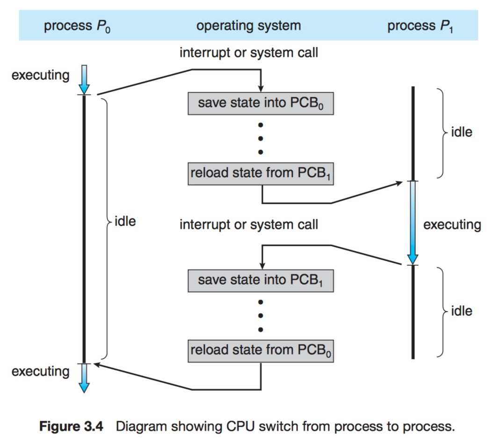
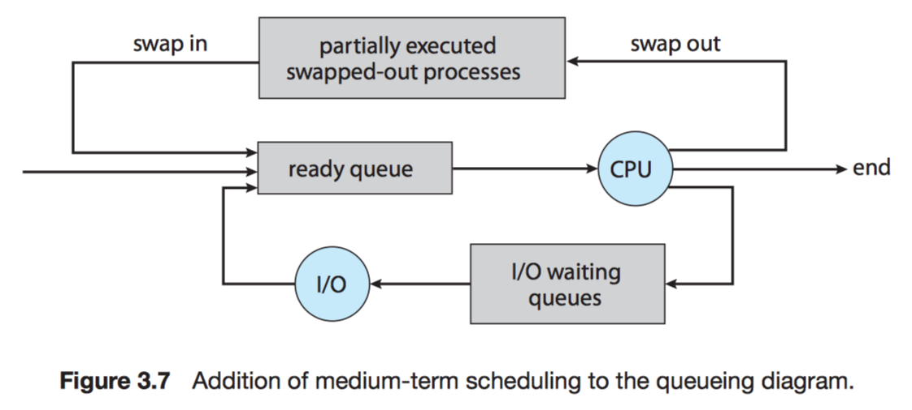
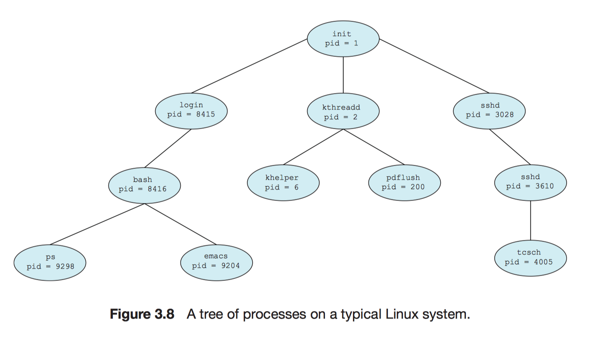

# Chapter 3 Process Concept

## 3.1 Process Concept

!!! note "Process"
    A program in execution, the basis of all computation.

 - batch system: jobs (= process)
 - time-shared system: user programs or tasks

### 3.1.1 The process

Process consists:

- **text** section: program code
- **data** section: contains *global variables*
- **heap**: memory
- current activity (*program counter* + *registers*)
- **stack**: contains *temporary data*
    - function parameters
    - return addresses
    - local variables

        


| Program | Process |
| :-: | :-: |
| *passive* entity | *active* entity |
| a file containing a list of instructions stored on disk (executable file) | program counter: specifying the next instruction to execute + a set of associated resources |

When an executable file is loaded into memory: **program -> process**

- double-clicking an icon
- prog.exe
- a.out

Two different processes: the text section are equivalent, the data, heap and stack vary.

Process can be an execution environment for other code. (**simulation**)

eg.

```java
java testProgram
```

!!! info
    The command `java` runs the JVM as an ordinary process, then executes the Java program `testProgram` in the VM.

### 3.1.2 Process State

- **New**.
- **Running**: execute instructions
- **Waiting**: wait some event (I/O, signal)
- **Ready**: wait to be assigned to a processor
- **Terminated**.


!!! note
    Only **1** process run on any processor. (Many processes may be **ready** and **waiting**.)

### 3.1.3 Process Control Block

- **Process state**.
- **Program counter**: address of the next instruction.
- **CPU registers**: accumulators, index registers, stack pointers, general-purpose registers, and any condition-code information.
- **CPU-scheduling information**.
- **Memory-management information**.
- **Accounting information**: the amount of CPU and real time used, time limits, account numbers, job or process numbers.
- **I/O status information**: the list of I/O devices allocated to the process, a list of open files.



## 3.2 Process Scheduling

- **Multiprogramming**: to have some process running at all times -> maximize CPU utilization
- **Time sharing**: switch the CPU among processes.

- **Process scheduler**: selects an available process

### 3.2.1 Scheduling Queues

As processes enter the system, they are put into a **job queue**.

**Job queue**: consists of all processes in the system.

**Ready queue**: keep *ready* and *waiting* processes.


When a process exit, it is removed from all queues and has its PCB and resources deallocated.

### 3.2.2 Schedulers

Processes are first spooled to a mass-storage device (eg. disk). Then 

- the **long-term scheduler**, or **job scheduler**

    1. selects processes from this pool.
    2. loads theme into memory *for* execution.

- the **short-term scheduler**, or **CPU scheduler**

    1. selects from among the processes that are ready to execute
    2. allocates CPU to one of them.

*Notice:*

- the **long-trem scheduler**

    - controls the **degree of multiprogramming** (# processes)
    - selects a good **process mix** of I/O-bound and CPU-bound.

- the **medium-term scheduler**: swapping.



### 3.2.3 Context Switch

!!! info "When a context switch occurs"
    The kernel saves the context of the old process in its PCB and loads the saved context of the new process scheduled to run.

## 3.3 Operations on Processes

### 3.3.1 Process Creation

!!! note "process identifier (pid)"
    An integer number, which provides a unique value for each process in the system, and it can be used as an _index_ to access various attributes of a process within the kernel.

!!! note "init"
    A process has pid = 1, and serves as the root parent process for all user processes.



When a process creates a child process, that child process may obtain the resources from

- OS
- a subset of parent process

When a process creates a new process:

1. The parent continues to execute concurrently with its children.
2. The parent waits until some or all of its children have terminated.

There are also two address-space possibilities for the new process:

1. The child process is a duplicate of the parent process (it has the same program and data as the parent).
2. The child process has a new program loaded into it.

!!! note "`fork()`"
    The new process created by `fork()` consists