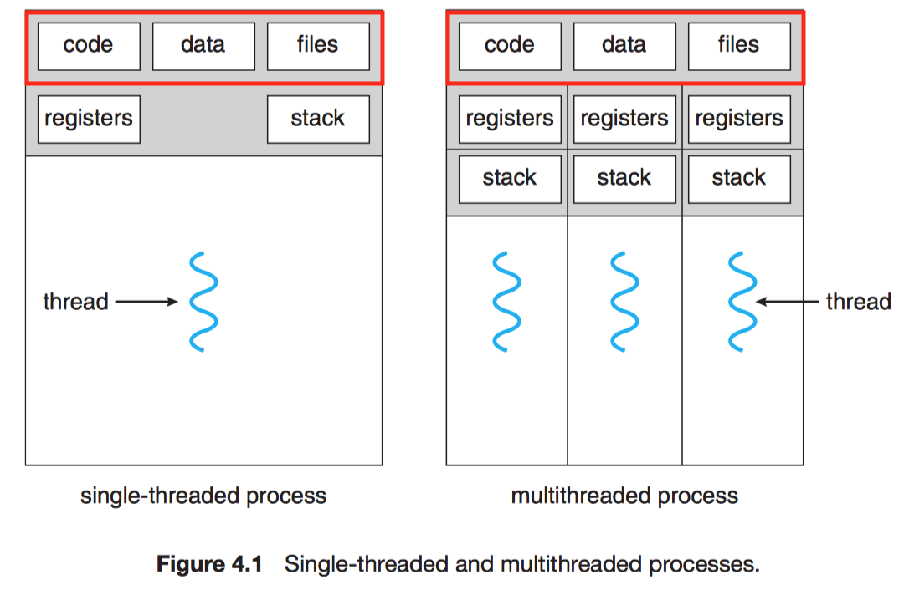

# Chapter 4 Threads

## 4.1 Overview

!!! note "Thread"
    A basit unit of CPU utilization.

A thread shares

- code section
- data section
- OS resources (eg. open files and signals)
- 
A thread have its own

- thread ID
- program counter
- register set
- stack

### 4.1.1 Motivation

It is generally more efficient to use one process that contains multiple threads since process creation is time consuming and resource intensive.

### 4.1.2 Benefits

The benefits of multithreaded:

1. **Responsiveness**.
2. **Resource sharing**.
3. **Economy**.
4. **Scalability**.

## 4.2 Multicore Programming

A more recent, similar trend in system design is to place multiple computing cores on a single chip.

!!! note "Multicore or Multiprocessor systems"
    The cores appear across CPU chips or within CPU chips.

Consider an application with 4 threads.

- With a single core

    

- With multiple cores

    

| Parallelism | Concurrency |
| :--: | :--: |
| Perform more than one task simultaneously. | Allow all the tasks to make prograss. |

!!! note "Amdahl's Law"
    If $S$ is the portion cannot be accelerated by $N$ cores (serially).
    
    $$speedup \le \frac{1}{S + \frac{(1 - S)}{N}}$$

### 4.2.1 Programming Challenges

1. Identifying tasks.
2. Balance. (Equal value)
3. Data splitting.
4. Data dependency.
5. Testing and debugging.