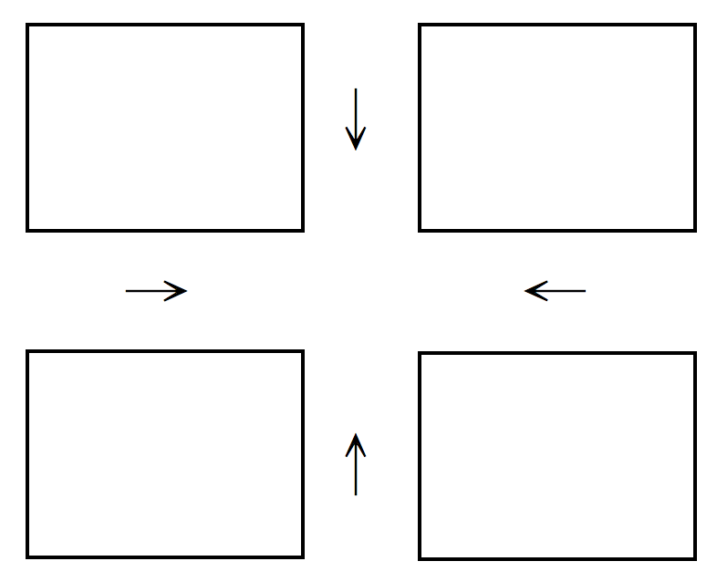

# Previous Operating System Midterms at NTUCSIE

## [Spring 2011](https://www.ptt.cc/man/NTU-Exam/DE0A/D36A/D55E/D109/M.1326244112.A.7FA.html)

1. Terminologies. (24pts)

    - **Security**

        <span style="color:red">Defense of a system from external and internal attacks, e.g., viruses, denial of services, etc.

    - **A Layered Approach in OS Designs**

        <span style="color:red">The operating system is broken into a number of layers (levels). The bottom layer (layer $0$) is the hardware; the highest (layer $N$) is the user interface.

    - **Para-virtualization**

        <span style="color:red">A variation on virtualization that presents a guest/operating system that is similar but not identical to the underlying hardware.

    - **Lightweight Process**

        <span style="color:red">A virtual processor (kernel threads) on which the application can schedule a user thread to run. (many-to-many or two-level)

    - **NUMA**

        <span style="color:red">Non-Uniform Memory Access: A CPU has faster access to some parts of main memory than to other parts.

    - **Deterministic Modeling**

        <span style="color:red">Take a particular predetermined workload and defines the performance of each algorithm for that workload.

    - **Race Condition**

        <span style="color:red">Several processes access and manipulate the same data concurrently and the outcome of the execution depends on the particular order in which the access takes place.

    - **Write Ahead Logging**

        <span style="color:red">All modifications are written to a log before they are applied.

2. Please answer following questions regarding the design the design of operation systems. (22pts)

    There are two conflicting goals in OS designs: Convenience and Efficiency.
    
    - Please give me one example feature of OS that shows the conflict in persuing efficiency and convenience (Hint: Live preview of open windows for Windows7 taskbar). (5pts)
    - What is the main goal of Unix process init? Is init a user or kernel process? (8pts)
    - Please explain how I/O protection is done. (5pts)
    - Give me one advantage in OS implementations in some high-level language. (4pts)

3. Please answer the following questions for process managment. (16pts)
    
    - Inside the Process Control Block, we might have a filed "Program Counter". What is the purpose of the field? (4pts)
    - There are a lot of segments for a process image, such as code segment, data segment, heap, and user stack. When we call malloc() or free(), which segment is involved? (4pts)
    - When a parent process calls fork() to create a child process, how does the parent process know the process ID of the created child process? (4pts)
    - Which of the following IPC mechanisms does not require two communicating processes to have a parent-child relationship: Named Pipes and sockets. (4pts)

4. Please answer the following questions for CPU scheduling. (17pts)

    - Compared to user-level threads, why the cost of context switching for kernel-level threads in higher? (4pts)
    - The delivery of a signal for theads is complicated. Give me an example signal that should be delivered to the threads to which the signal applies. (4pts)
    - For preemptive scheduling, there are serveral occasions in triggering scheduling. Please give me three, beside the one in which a running process terminates by itself. (9pts)

5. Consider Shortest-Job-First(SJF) and Round-Robin(RR) scheduling algorithms, and processes under considerations are only of one single CPU burst and are all ready at time 0. Please answer the folowing questions. Explanation is needed to receive any credit: (18pts)

    - Is SJF always better than RR, for any time quantum, in terms of the average turnaround time?(6pts)
    - When all processes are of the same size, please tell us what the best time quantum is for RR in terms of the average waiting time. (6pts)
    - Now suppose that processes might arrive at different times, and SJF and RR are preemptive scheduling algorithms. Is SJF always better than RR, for any time quantum, in terms of the average waiting time. (6pts)

6. Please design a solution for airplanes to land in an airport. Suppose that there is only one runway in the airport. Please make sure that only one airplane can control the runway to land at a time, and there should be no starvation for your solution. (Hint: (1) the Bakery Algorithm; (2) Each process donotes an airplane.) (10pts)

## [Fall 2011](https://www.ptt.cc/bbs/NTU-Exam/M.1335413893.A.32B.html)

The exam is 180 minutes long. The total score is 107pts. Please read the questions carefully.

1. Terminologies. (24pts)

    - **DMA**

        <span style="color:red">Release CPU from handling excessive interrupts!
        Execute the device driver to set up the registers of the DMA controller. DMA moves blocks of data between the memory and its own buffers. Transfer from its buffers to its devices. Interrupt the CPU when the job is done.

    - **Multiprogramming**

        <span style="color:red">Increases CPU utilization by organizing jobs so that the CPU always has one to execute.

    - **Horizontal Cache Coherency and Consistency**

        <span style="color:red">Among units of the same storage level.
        
        <span style="color:red">From [知乎](https://www.zhihu.com/question/25252397):

        - <span style="color:red">Coherence 保證的是同一地址有不同 copy 的時候，保證看到的是在 timing 上離自己最近的。
        - <span style="color:red">但是，只保證 Coherence 是不夠的，在 multiprocessor 不同地址的多個 copy 訪問的時候會出現問題，這個就是consistency

        - <span style="color:red">Coherence is concerned with updates/invalidations to a single shared variable.
        - <span style="color:red">Consistency is concerned with the behavior of memory references from multiple concurrent threads.

    - **A Module Approach in OS Designs** (Hint: A Layered Approach) [ask]

        <span style="color:red">Moving all nonessential components from the kernel to the user or system programs!

    - **Indirect Communication in Message Passing** ($\leftrightarrow$ Direct)

        - <span style="color:red">The messages are sent to and received from mailboxes, or ports.
        - ($\leftrightarrow$) The messages are sent to and received from processes.

    - **Socket**

        <span style="color:red">An endpoint for communication. (IP + port#)

    - **Deferred Cancellation** ($\leftrightarrow$ Asynchronous Cancellation)

        - <span style="color:red">The target thread periodically checks whether it should terminate, allowing it an opportunity to terminate itself in an orderly fashion.
        - ($\leftrightarrow$) One thread immediately terminates the target thread.

    - **Pull Migration** (Hint: Multipocessor Scheduling) ($\leftrightarrow$ Push Migration)

        - <span style="color:red">Pulling a waiting task from a busy processor.
        - ($\leftrightarrow$) Pushing processes from overloaded to less-busy processors.

2. Please answer the following questions regarding the designs of operating systems: (23pts)
    - Please give me two resources, beside CPU, that are managed by OS. (6pts)
    - When an interrupt arrives, a running task is interrupted, and its context could be saved in different ways, such as "a fixed address for all interrupts", "a fixed space for each interrupt type", and "a stack". What is the advantage in using a stack, compared with the approach in using a fixed space for each interrupt type? (5pts)
    - In a memory hierarchy, we have registers, cache, memory, and disk. Which of them is managed by operating systems? Which of them is managed by hardware? (l2pts)

3. OS services are such as those for "program execution", "file-system manipulation", "accounting", and "resource allocation". Which of them are for system efficiency, instead of user convenience? (8pts)

4. Famous Application Programming Interfaces (API) are such as Win 32 API and POSIX API. What are the two major benefits in providing API, compared to
   the providing of system calls only? What does POSIX API offers to programmers, compared to the offering of ANSI C to programmers? (8pts)

5. In the ordinary virtualization design, the virtualization layer runs in the system mode. For VMware, the virtualization layer runs in the system or user mode? For Java, the Java virtual machine run in the system or user mode? (6pts)

6. Please answer the following questions for process management and scheduling. (20pts)

    - Give me two conditions for a running process to relinquish the CPU to go back to the ready queue in preemptive CPU scheduling. (6pts)
    - Why a long-term scheduler has more time to choose a process for a system than a short-term scheduler does in process scheduling? (5pts)
    - Please explain the main difference between a user-level thread and a kernel thread. (5pts)
    - Is a Java thread is a user-level thread or a kernel thread? (4pts)

7. The scheduling algorithm of Solaris 9 is based on the Multilevel Feedback Queue Scheduling algorithm. There are six priority classes. Please explain the Fair Sharing class? Please explain how interactive threads in the Time Sharing or Interactive class are favored in scheduling in Solaris 8 or 9? (6pts)

8. Consider the scheduling of processes in which processes might arrive at different times and have different deadlines to complete their execution. Let the processes be scheduled by the preemptive Shortest-Job-First algorithm (PSJF) and a Priority Scheduling algorithm (PS) in which processes with urgent deadlines have higher priorities, and there is only one processor. Can you give a set of processes such that PS can meet the deadlines of the processes, but PSJF can not do it? (5pts)

9. Consider the Round Robin scheduling algorithm (RR) with two different time quantums L and S, where L > S. Let the scheduling criteria be the average
   waiting time, and L be larger than the largest CPU burst of all processes. Does RR, in general, favor a small time quantum S when all processes are
   ready at time 0? Please give me your answer with argument. (7pts)

## [Fall 2012](https://www.ptt.cc/bbs/NTU-Exam/M.1418537836.A.BB5.html)

The exam is 180 minutes long. The total score is 110pts. Please read the questions carefully.

1. Terminologies. (24pts)

    - **Hardware Interrupt**

        <span style="color:red">Services requests of I/O devices.

    - **Virtual Machine**

        <span style="color:red">Provides an interface that is identical to the underlying bare hardware.

    - **Context Switch**

        <span style="color:red">It saves the state of the currently running process and loads the state of the newly scheduled process.

    - **A Full Duplex Pipe**

        <span style="color:red">A pipe that suppors two ways of message passing simultaneously.

    - **Multilevel Queue Scheduling**

        <span style="color:red">Processes can be classified into different groups and permanently assigned to one queue, where there are Inter-queue and intra-queue scheduling policies.

    - **Memory Stall**

        <span style="color:red">A phenomenon in which a processor waits for a significant amount of time waiting for the data to become available.

    - **Bounded Waiting** (A Requirement of a Critical Section Solution)

        <span style="color:red">A waiting process only waits for a bounded number of processes to enter their critical sections.

    - **Adaptive Mutex**

        <span style="color:red">A binary semaphore in which it is a spinlock if the lock-holding thread is running; otherwise, blocking is used.
 
2. Please answer the following questions regarding the designs of operating systems: (20pts)

    - What is the difference between **multiprogramming** and **time sharing**? (6pts)

        <span style="color:red">Time sharing (or multitasking) is a logical extension of multiprogramming, where CPU services each of ready tasks in a way that every task receives CPU time in an interactive fashion.

    - Which one of the following memory unit is managed by the operating systems: Registers, Cache, Main Memory, Disks (8pts)

        <span style="color:red">Main Memory and Disks.

    - Operating systems services include user interfaces. UNIX shells, including the Bourne shell and C shell, provide command interpreters. Consider UNIX shells, please give me one command that is implemented as some code inside the command interpreter and two commands that are implemented by system programs? (6pts)

        - Inside the command interpreter:
            - C shell: <span style="color:red">umask, cd and limit
            - Bourne shell: <span style="color:red">ulimit -H and -S

        - By system programs: <span style="color:red">rm and ls

3. Message passing is a way for interprocess communication. Consider the capacity of a link between two processes has zero capacity. Is the message passing (between the two processes) synchronous or asynchronous? You must provide explanation to receive any credits. (5pts)

    <span style="color:red">It is synchronous because we can only have blocking sends and blocking receives.

4. 
    - Please give me one occasion when a mid-term scheduler should run.

        <span style="color:red">The remaining main memory is low or the CPU utilization is too high.

    - Can a short-term scheduler schedule the executions of user-level threads?

        <span style="color:red">No.

    - Can a short-term scheduler schedule the executions of a Java thread? (9pts)

        <span style="color:red">It depends on the thread library on the host system.

5. Consider signal handling for threads. 

    - Is a Division-By-Zero signal synchronous or asynchronous?

        <span style="color:red">Synchronous.

    - Should a Division-By-Zero signal be delivered to every thread of its belonging process? (6pts)

        <span style="color:red">No. It should be only sent to the thread that causes the signal.

6. Please answer the following questions for process scheduling. Explanation is needed to receive any credit. (24pts)

    - For the Round-Robin Scheduling, what would be the preferred time slice in general? (4pts)

        <span style="color:red">The time slice $\ge 80\%$ CPU burst.

    - For the Round-Robin Scheduling, shall we have a small time slice for a better average turn around time? (4pts)

        <span style="color:red">No, a small time slice will increase the average turnaround time.

    - For the Priority Scheduling, how to avoid the starvation problem (in which a low priority process can never be scheduled)? (4pts)

        <span style="color:red">An **aging** solution by increasing the priority of a process that waits for a long time.

    - Please explain how a guest operating-system scheduling algorithm that assumes a certain amount of progress in a given amount of time might be negatively impacted by virtualization. (6pts)

        <span style="color:red">It is because the virtualization software needs to schedule the use of the physical CPUs among the virtual CPUs. A given amount of the time slice might take much more than the time of the virtual CPU time.

    - For the evaluation of a scheduling algorithm, please give me two difficulties in using the implementation method. (6pts)

        - <span style="color:red">Cost in modifying the OS
        - <span style="color:red">User reaction to OS changes
        - <span style="color:red">Changing of the environment in which the algorithm is used

7. Please explain the difference between the signal operation of a binary semaphore and that of a condition variable (of a monitor). (5pts)

    <span style="color:red">The signal operation of a condition variable resumes one suspended process. If there is none, no effect is imposed.

8. Consider a barber shop in which there are two barbers. Each barber can service exactly one customer at a time. Please use binary semaphores to implement the request for the hair-cut service. (12pts)

    <span style="color:red">Use an integer $S$ with initial value = $2$ to indicate the number of available barbers.

    ```c
    typedef struct {
        int value;
        struct process *waiting_list;
    } semaphore;
    ```

    ```c
    wait(semaphore *S) {
        S->value--;
        if (S->value < 0) {
            add this customer to S->waiting_list;
            block();
        }
    }
    ```

    ```c
    signal(semaphore *S) {
        S->value++;
        if (S->value <= 0) {
            remove a process P from S->waiting_list;
            wakeup(P);
        }
    }
    ```

9. Consider the time-stamp protocol of Chapter 6, in which each process $T_i$ is given a time stamp $T_S(T_i)$, and each read/write operation must check it up with the read and write timestamp of the accessed data object $Q$. Is it possible to have any deadlock? You must provide your explanation. (5pts) [ask]

    <span style="color:red">No deadlock because there is no hold-and-wait among processes.

## [Fall 2013](https://www.ptt.cc/bbs/NTU-Exam/M.1402216802.A.99D.html)

The exam is 180 minutes long. The total score is 103pts. Please read the questions carefully.

1. Terminologies. (24pts)

    - **Booting**

        Initialize all aspects of the system and then load and run the OS.

    - **Interrupt Vector**

        An array of interrupt-handlers' addresses that are indexed by device numbers (or interrupt numbers).

    - **Cache Coherency** [Fall 2011 1.(c)]

        Cache coherency problems can arise when more than one processors refer to the same data. Coherency defines what value is returned on a read.

    - **Platform as a service (PaaS) in Cloud Computing**

        Pass provides a computing platform and a solution stack as a service, such as a database server. One example is Microsoft Azure.

    - **A Modular Kernel** (Hint: OS Structure) [Fall 2011 1.(d)]

        A moduler kernel consists of a set of components, where there are core/primary modules, and it is of modules without a layer structure.

    - **Data Parellelism in Multicore Programming**

        Distribute data over cores to execute the same operation.


    - **Rate Monotonic Scheduling**

        A fixed priority real-time process scheduling algorithm in which the priorities of processes are inversely proportional to their periods.

    - **Deterministic Modeling** [Spring 2011 1.(f)]

        Take a particular predetermined workload and defines the performance of each algorithm for that workload.

2. Please answer the following questions regarding the designs of operating systems: (20pts)

    - There are two conflicting goals in the designs of operating systems. What is the other one, beside "convenient for the users" ? (3pts)
    - Which one of the following actions/events is belonging to or might result in software interrupts: System calls, child termination, mouse clicking, invalid memory access. (8pts)
    - Consider the implementation of virtual machines in which operating systems run on the top of the virtual machine software (or referred to as the hypervisor). Is an operating system running in the user mode or kernel mode? (3pts)
    - Please give me 2 advantages of virtual machines, beside system consolidation and easy in system development/deployment. (6pts)
        
3. ANSI C refers to the family of successive standards published by ANSI for the C programming language. Please compare difference (or provide the purpose difference) between POSIX and ANSI C. (5pts)
       
4. Please answer the following questions for task scheduling. (14pts)

    - Is the "Swapper" a short-term or mid-term scheduler?
    - In Unix, the process control block PCB[] of a process consists of proc[] and .u, where the attributes in .u are those needed when the process is running, and the attributes in proc[] are those needed all the time. Please indicate which one should be in .u : file[], task priority, pid, signal disposition, and task state. You must provide explanation to receive any credits. (10pts)

5. Consider message passing and shared memory for inerprocess communication. Is "Pipe" considered one for message passing or shared memory ? Is "Pipe" direct or indirect communication ? Is it "synchronous" or "asynchronous"? for a reader or a writer of the communication in Unix. You must provide explanation to receive any credits. (12pts)

6. Kernel-level threads are superior than uer-level threads do in many ways. What is the main disadvantage of kernel-level threads ? With OpenMP in program development, shall we prefer kernel-level or user-level threads? You must provide explanation to receive any credits. (8pts)

7. Please answer the following questions for process scheduling. Explanation is needed to receive any credits. (15pts)

    - Given 3 processes P1, P2, and P3 with CPU burst time 5, 6, 7, respectively. Suppose that the 3 processes arrive at time 0, and P1 and P3 are the first and the last processes in the ready queue, respectively. What is the average waiting time in running the 3 processes under the Round-Robin Scheduling with the time slice equal to 3. (5pts)
    - Consider FCFS and Round-Robin Scheduling. If process are only of CPU burst and all arrive at time 0, do FCFS and Round-Robin Scheduling with time slice = 1 always have the same total waiting time in running all processes ? Prove your answer. (5pts)
    - Suppose that the variance of the tunaround time is the cirterion in process scheduling. Shall we have a small time slice for a better variance turnaround time when all processes arrive at time 0? (5pts)

8. Please explain why the Completely Fair Scheduling (CFS) of Linux V2.6 favors I/O tasks. (5pts)
       
## [Fall 2014](https://www.ptt.cc/bbs/NTU-Exam/M.1434421485.A.9E4.html)

The exam is 180 minutes long. The total score is 108pts. Please read the questions carefully.

1. Terminologies. (24pts)
   
    - **Buffering** (Hint: It is not caching.)

        It means to keep data in a faster medium temporarily before moving them to a slower layer.

    - **Virtual Machine** [Fall 2012 1.(b)]

        Provides an interface that is identical to the underlying bare hardware.

    - **System Generation** (SYSGEN)

        The process to configure or generate an operating system for a one specific computer.

    - **Context Switch** [Fall 2012 1.(c)]

        Save the state of the old process and load the state of the newly scheduled process.

    - **Remote Procedure Call** (Hint: Message Passing)

        Senders are blocked until the receivers have received msgs and replied by reply msgs. (A way to abstract the procedure-call mechanism for use between systems with network connection.)

    - **Implicit Threading**

        Transfer the creation and management of the threading from the application developers to compilers and run-time libraries.

    - **Earliest Deadline First Scheduling**

        A dynamic-priority real-time process scheduling algorithm in which the priorities of processes are higher if their deadlines are closer.

    - **Race Condition** [Spring 2011 1.(g)]

        Several processes access and manipulate the same data concurrently and the outcome of the execution depends on the particular order in which the access takes place.

2. Please answer the following questions regarding the designs of operating systems: (22pts)
    - An operating system could be considered as a resource allocator. Please list 3 resources managed by an operating systems. (6pts)
    - Please explain what happens to the operating system when an interrupt arrives (until the interrupt is serviced). (4pts)
    - Which one of the following instructions is a privileged instruction:

        Reading of the Timer, setting of the base register of the memory space of a process, increment the value of a CPU register by one. No explanation is needed. (6pts)
    
    - Please explain what happens when a command-line user interface of Unix executes a command. (6pts)

3. Consider parameter passing to a system call. Give me the major advantage in having a register pointing to a memory block that stores all parameters, compared to having all parameters stored in registers? (5pts)

4. The memory image of a Unix process might consist of a code segment, a data segment, a heap area, a user stack, a kernel stack, an environment variable area, and .u. Which one of the above is used when `malloc()` is invoked? When the kernel stack is used? (8pts)

5. Please explain how `fork()` works when a parent process invoke `fork()`. Please use the answer to the `fork()` invocation to explain the difference between `fork()` and `vfork()`. (10pts)

6. In the multi-core age, threading is encouraged. Please answer the following questions: (8pts)
    - For multiple cores, do we prefer kernel-level threads or user-level threads? Why? (3pts)
    - There are also challenges in programming. Consider merge sorting, in which an unsorted list is divided into $N$ sublists, each containing $1$ element, and then we repeatedly merge sublists to produce new sorted sublists until there is only $1$ sublist remaining. This will be the sorted list. Please use the concept of task parallelism to execute the merge sort over $N$ cores. (5pts)

7. Please answer the following questions for process scheduling. Explanation is needed to receive any credit. (15pts)

    - Given 5 processes P1, P2, P3, P4, and P5 with CPU burst time 6, 5, 2, 10, 5, respectively. Suppose that the P1, P2, P3, P4, and P5 arrive at time 0, 3, 4, 2, and 5, respectively. What is the average waiting time in running the 5 processes under the Preemptive Shortest-Job-First Scheduling. (5pts)
    - Consider Shortest-Job-First Scheduling and Round-Robin Scheduling. Please prove that the total waiting time in running all processes under Shortest-Job-First Scheduling is always no larger than that of Round-Robin Scheduling with time slice equal to 1 when all processes are ready at time 0? (5pts)
    - Suppose that the variance of the waiting time is the criterion in process scheduling. Shall we have a small time slice for a better variance for Round-Robin Scheduling when all processes of the same CPU burst arrive at time 0? (5pts)

8. Please answer the following questions for process synchronization: (16pts)
   
    - Please compare the difference between a binary semaphore and a condition variable. (3pts)
    - Please use Monitor to implement Consumer and Producer with a bounded buffer. (10pts)
    - Please prove that your above solution satisfy the Progress requirement of the Critical Section Problem. (3pts)

## [Fall 2015](https://www.ptt.cc/bbs/NTU-Exam/M.1466605487.A.7AD.html)

The Exam is 180 minutes long. The total score is 105pts. Please read the questions carefully.

1. Terminologies.(24pts)

    - **Software Interrupts**

        Caused by software execution, e.g. signals, invalid memory access, division by zero, system calls.

    - **Performance Tuning**

        A procedure that seeks to improve performance by removing bottlenecks.

    - **Mid-Term Scheduler** ($\leftrightarrow$ Long-Term Scheduler $\leftrightarrow$ Short-Term Scheduler)

        - Swap processes in and out to control the degree of multiprogramming.
        - ($\leftrightarrow$) Long-Term Scheduler:
            - Selects processes from this pool
            - Loads theme into memory for execution
            - Controls the degree of multiprogramming (# processes). 
            - Selects a good process mix of I/O-bound and CPU-bound.
        - ($\leftrightarrow$) Short-Term Scheduler:
            - Selects from among the processes that are ready to execute
            - Allocates CPU to one of them

    - **FIFOS of UNIX**

        Named pipes.

    - **Asynchronous Signal** ($\leftrightarrow$ Synchronous Signal)

        - An asynchronous signal usually reports some asynchronous event outside the program, e.g., ^C or time expiration.
        - ($\leftrightarrow$) Delivered to the same process that performed the operation causing the signal. e.g., illegal memory access, division by 0.

    - **Push Migration** (Hint: Load Balancing) [Fall 2011 1.(h)] ($\leftrightarrow$ Pull Migration)

        - Pushing processes from overloaded to less-busy processors.
        - ($\leftrightarrow$) Pulling a waiting task from a busy processor.

    - **Coarse-Grained Multithreading of Hardware Threads** ($\leftrightarrow$ Fine-Grained (interleved))

        - A thread executes on a processor until a long-latency event such as a memory stall occurs.
        - ($\leftrightarrow$) Switches between threads at a much finer level of granularity

    - **Analytic Evaluation** [Spring 2011 1.(f), Fall 2013 1.(h)]

        Analytic evaluation uses the given algorithm and the system workload to produce a formula or number to evaluate the performance of the algorithm for that workload.

2. Please answer the following questions regarding operating systems: (20pts)
    - Please compare the difference between interrupt handling by a generic handler and interrupt vector in terms of the mechanism and the response performance. (6pts)
    - Please compare the difference between the terms "time sharing" and "multiprogramming". (4pts)
    - One of the most challenging parts in the implementations of a virtual machine is to satisfy the assumption of a certain amount of progress in a given amount of time. Please explain the challenge. (6pts)
    - Parameter passing is an important issue in the implementation of command interpreters. Please explain how a command interpreter of Unix passes parameters to the running process of a command issued on the command interpreter. (4pts)

3. Consider process states: New, Ready, Running, Waiting, and Terminated. Please explain how a state makes a transition to another state, where there is only one processor. (12pts)

4. Message passing is one major way for interprocess communication. What is the main difficulty in using symmetric addressing for direct communication? For indirect communication, small messages are sent from a sender to a receiver usually by message copying. How to reduce system overheads in-sending large messages to a receiver? (8pts)

5. For multicore programming, there could be data parallelism or task parallelism. Please explain how to use data parallelism to find the largest integer of a given set of integers. (5pts)

6. Please answer the following questions for process scheduling. Explanation is needed to receive any credit. (15pts)

    - Is the First-Come, First-Served Scheduling (FIFO) a non-preemptive or preemptive scheduling algorithm? Why? (4pts)
    - Given 4 processes P1, P2, P3, and P4 with CPU burst time 5, 2, 4, and 6, respectively. Suppose that the P1, P2, P3, and P4 all arrive at time 0. What is the average waiting time in running the 4 processes under the Round-Robin Scheduling with the time slice equal to 3? (5pts)
    - Longest-Job-First Scheduling always schedules the process of the longest CPU burst first. When all processes arrive at time 0, does Longest-Job-First Scheduling have the largest average turnaround
       time? (6pts)

7. Consider the intersection of the following two roads, where cars can go from each of the four directions. There is a stop sign for each direction so that every car must stop at the intersection and wait for any car that arrives earlier at the intersection to leave first.

    - Please use semaphores to implement your solution with some pseudo code. (10pts)
    - Please prove that your above solution satisfy the three requirements of the Critical Section Problem. (6pts)
    - Could you revise your solution so that an ambulance can always go first? (5pts)

        
